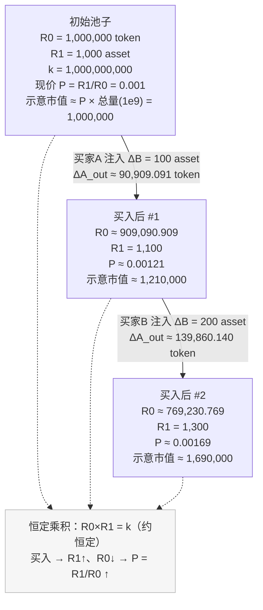

**产品需求文档（PRD）— @contracts/fun 模块**

**版本**
- 目标版本: v1.0
- 更新时间: 2025-08-30

**背景与目标**
- 背景: 为社区用户提供“快速发行-交易-毕业”的迷因代币到虚拟人Agent生态的通道。用户可以少量资产快速创建代币（fun-token），在简化的恒定乘积做市曲线内完成初期交易，当达到毕业阈值后，自动迁移到AgentFactory，生成正式的Agent Token与DAO治理结构。
- 目标: 提供一套轻量、低成本、可升级的代币发行与毕业机制，沉淀资金到Agent生态，保障用户资产与体验一致性。

**范围**
- 包含: 合约 `Bonding`, `FFactory`, `FRouter`, `FPair`, `FERC20`, 接口 `IFPair` 及与 `IAgentFactoryV3` 的集成。
- 不包含: Uniswap 真实路由交互、前端实现、治理细则（由 AgentFactory/DAO 负责）、跨链桥等。

**角色与权限**
- 用户: 任何EOA，可发起 `launch`、`buy`、`sell`（基于路由权限间接执行）。
- 管理员/运营: 拥有工厂/路由管理权限（ADMIN_ROLE/CREATOR_ROLE/EXECUTOR_ROLE），配置税收、路由指向、税务管理器等。
- 系统合约: `FFactory`（管理交易对）、`FRouter`（撮合/结算/费用）、`FPair`（储备与转移）、`Bonding`（业务编排）、`FERC20`（迷因代币）。
- 外部合约: `IAgentFactoryV3`（毕业后生成Agent生态）。

**关键概念**
- 资产代币: `assetToken`（如 $VIRTUAL），为交易基准资产。
- fun-token: 由 `Bonding.launch` 创建的 `FERC20`，名称前缀 `fun <name>`，受单笔最大转账限制 `maxTx`（占总量百分比）。
- 简化做市: 使用 `FPair` 维护 `(reserve0, reserve1, k)`，`FRouter` 按 `x*y=k` 近似计算 `getAmountsOut`，并征收买/卖税。
- 毕业（Graduate）: 在买入推动下，当代币储备降至阈值 `gradThreshold`，触发 `Bonding._openTradingOnUniswap`，将池中资产迁移到 `AgentFactory` 初始化 Agent，回收/销毁 fun-token 并由配对池持有新的 Agent Token，用户可 `unwrapToken` 1:1 换取 Agent Token。

**用户故事**
- 阅读提示（符号与直觉速览）:
  - R0/R1: 池中储备（R0=fun-token 数量，R1=资产代币数量）。
  - k': 常数乘积（在铸造初始储备时确定），保持近似恒定用于定价。
  - ΔB: 买入时扣除买入税后的“净注资”，实际进入池子的资产代币数量。
  - ΔA_out: 买入得到的 fun-token 数量，恒定乘积决定“越往后买越贵”。
  - P: 价格（资产代币/每枚 fun-token），P=R1/R0；买入使 R1↑、R0↓，价格上升；卖出相反。
  - G: 毕业阈值（gradThreshold，18位精度的代币数量），当 R0≤G 触发毕业迁移。
  - 直觉: 恒定乘积相当于“水桶两端连着杠杆”，往资产侧倒水（买入）就会从代币侧挤出代币且价格抬升；反之亦然。
- 创作者—我想快速发行代币并完成初始做市:
  - 作为: 代币创作者
  - 我需要支付: 网络已配置的资产代币（例如 $VIRTUAL）。一次发行会支付一笔总额，其中固定部分作为发行费用直接进入费用地址（如 Treasury/国库）；剩余部分作为“初始买入金”。如果设置了买入税，则进入池子的实际金额为“初始买入金扣税后的净注资”。
  - 我将得到: 新发行的迷因代币 fun-token（代币名: `fun <name>`；代号: `<ticker>`）。系统会用我的初始买入金在池子中为我买入，并把获得的 fun-token 直接发还给我。注意：本机制不铸造 LP 份额，我不会拿到任何 LP 代币；fun-token 受单笔最大转账 `maxTx` 约束。
  - 系统会同时: 为 fun-token 与资产代币创建交易对并注入初始流动性；记录我的创作者档案；完成“上线”记录。
  - 初始流动性添加者: 由协议在 `launch` 流程中自动完成，`Bonding` 调用 `FRouter.addInitialLiquidity` 设置 `(R0, R1)=(S, R1_init)` 与 `k`（仅 `EXECUTOR_ROLE` 可调用）。创作者/买家无需且不能手动添加 LP；资产侧的 `R1_init` 为协议计算并在池内设置，真实资产代币从我的 `initialPurchase` 起才注入池子。
  - 以便: 我能用较低成本一键发行并立刻有可交易的市场，快速验证社区兴趣。
  - 验收标准（含清晰代币与费用说明）:
    - 费用币种: 发行费用以资产代币计价并汇入费用地址（通常为国库）。
    - 我实际支付: 发行总支付 = 发行费用 + 初始买入金；若设置了买入税，进入池子的净注资为“初始买入金扣税后”的金额。
    - 我实际到手: 系统用我的初始买入金在池子中完成一次买入，到手的代币数量由恒定乘积模型计算，可理解为“保持乘积不变所挤出的代币”。
    - 简化解释: 净注资越多，边际到手越少（价格随买入抬升）。
    - 代币命名: 发行代币为 `fun <name>` / `<ticker>`；若日后毕业，Agent 代币命名形如 `<name> by Virtuals`（ticker 继承）。
    - 示例（与测试一致）: 若资产代币为 $VIRTUAL，`purchaseAmount = 200 $VIRTUAL`、`fee = 100 $VIRTUAL`、`buyTax = 0`，则 `initialPurchase = 100 $VIRTUAL`，我到手约 `32,258,064.5161` 枚 fun-token；Treasury 收到 `100 $VIRTUAL`；资金池资产增加 `100 $VIRTUAL`。

  发行与初始做市的 token 流转（Mermaid）:
  ```mermaid
  flowchart TB
    user["Creator/发行者"] -->|发行总支付（资产代币）\n例：200 $VIRTUAL| bonding[Bonding]

    %% 1) 创建交易对并注入初始做市储备
    bonding -->|创建交易对 + 设置初始储备\n代币=S；资产=R1_init；不产生LP| fpair[FPair/做市池]
    state["初始储备：代币=S；资产=R1_init；乘积常数已确定"]
    fpair -.-> state

    %% 2) 费用与初始买入拆分
    bonding -->|发行费用（资产代币）\n例：100 $VIRTUAL| treasury[Treasury/feeTo]
    bonding -->|初始买入金（总额-费用）\n例：100 $VIRTUAL| frouter[FRouter]

    %% 3) 初始买入（若有税）
    frouter -->|买入税（如有）\n例：0| taxvault[TaxVault]
    frouter -->|净注资（初始买入扣税后）\n注入做市储备\n例：+100 $VIRTUAL| fpair

    %% 4) 从池子给创作者发放 fun-token
    fpair -->|发放代币给创作者\n例：约 32,258,064.5161 枚 fun-token| user

    %% 说明
    classDef dim fill:#f6f6f6,stroke:#bbb,color:#333;
    treasury:::dim
    taxvault:::dim
    state:::dim
  ```

- 交易者—我想买入时清楚价格随买入变化:
  - 作为: 普通买家
  - 我希望: 输入期望买入资金后，清楚看到到手数量与滑点；明白连续买入会推高价格。
  - 以便: 控制成交价格与成本。
  - 验收标准:
    - 买入有效金额: 等于输入金额扣除买入税后的净额。
    - 到手数量与价格变化: 由恒定乘积模型计算；买入会让池内资产增加、代币减少，价格随之上升，连续买入会“越买越贵”。
    - 若设置最小到手量且不满足，则交易回滚。


- 持有者—我想在需要时卖出并理解税费影响:
  - 作为: 代币持有者
  - 我希望: 卖出时明确税费后实际获得的 `assetToken` 数量。
  - 以便: 做出流动性与收益判断。
  - 验收标准:
    - 可提出的资产: 根据恒定乘积模型计算出的差额；实际到账为上述金额扣除卖出税后的净额。
    - 简化解释: 你把代币卖回池子，池内代币变多、资产变少；能够提出的资产就是“保持乘积不变后多出来的那部分”，再扣掉卖出税即为到账。
    - 税收发送至税库地址；若定义了税务管理器，则可进一步处理。

- 社区—我们希望当热度足够时自动“毕业发射到 DEX”:
  - 作为: 社区/创作者/买家
  - 我们希望: 当买入推动储备降至阈值时，系统自动毕业，将资产迁移至 Agent 生态，并切换到成熟交易阶段。
  - 以便: 将成功的迷因沉淀为长期 Agent 项目。
  - 验收标准:
    - 触发条件: 买入后池内代币数量降至毕业阈值，且仍处于可交易状态。
    - 毕业价格与所需资金: 对应毕业阈值的价格由恒定乘积决定；达到毕业大致需要的累计净注资≈目标资产储备减去初始资产储备（忽略税费）。
    - 毕业后：状态切换为在本池停止交易并进入毕业模式，生成 Agent 代币；池内 fun-token 被销毁，Agent 代币进入待兑换池位。
  - 具体示例（买卖税率为 0，与测试参数一致）:
    - 基础参数: 代币总量为 10 亿枚；初始价格系数为 10000；常量 K 取 3×10¹²；毕业阈值为 8,500 万枚（按 18 位精度计）；发行费为 100 单位资产代币；创作者在发行时额外用 100 单位资产代币进行初始买入。
    - 初始储备: 池中代币侧初始储备等于代币总量；资产侧初始储备约为 3000 单位资产代币；两者共同确定一个“不变乘积”，用于后续定价。
    - 创作者初始买入后: 池内资产增加到 3100 单位资产代币；创作者因初始买入获得约 32,258,064.5161 枚代币。
    - 社区单笔买入: 若社区随后单笔买入 35,000 单位资产代币（无买入税），则净注入池子的资产也是 35,000，池内资产合计约 38,100 单位。
    - 毕业判断（口径说明: 为便于理解这里忽略 18 位精度）: 按恒定乘积模型估算，买入后池中的代币储备约为 78,743,961 枚，低于毕业阈值 85,000,000 枚，满足毕业条件，立即触发毕业。
    - 触发后的结果: 协议将池内资产迁移至 AgentFactory，生成对应的 Agent Token；池内的 fun-token 被销毁，用户后续可按 1:1 兑换 Agent Token。

- 持有者—我想把手中的 fun-token 兑换成 Agent Token:
  - 作为: 早期参与者/持有者
  - 我希望: 毕业后可以 1:1 将 fun-token 兑换为 Agent Token。
  - 以便: 延续我在早期的权益。
  - 验收标准:
    - 每个账户可按其持仓销毁等额 fun-token，并从池子领取等额 Agent Token。
    - 批处理支持一次性为多账户完成兑换，或提供自助兑换入口。

- 运营—我想可控地配置费用、税率与阈值:
  - 作为: 协议运营/多签管理员
  - 我希望: 能设置发行费用、买卖税率、毕业阈值、单笔限额、初始价格系数等，并具备安全护栏。
  - 以便: 在增长与风险之间取得平衡。
  - 验收标准:
    - 支持设置/更新 `fee`、`buyTax/sellTax`、`G(gradThreshold)`、`maxTx`、`assetRate` 等核心参数。
    - 设置需通过权限与范围校验；变更应广播事件，方便前端/监控同步。


**合约与职责**
- `Bonding`
  - 负责: 发行、初始买入、路由交互、毕业触发、与 AgentFactory 对接、unwrap 迁移。
  - 关键参数: `_feeTo`、`initialSupply`、`assetRate`、`gradThreshold`、`maxTx`、`agentFactory`、`fee`（注意缩放：初始化时 `fee = fee_ * 1e18 / 1000`）。
  - 事件: `Launched(token, pair, index)`、`Graduated(token, agentToken)`（`Deployed` 事件存在声明但当前流程未使用）。
  - 错误: `InvalidTokenStatus`、`InvalidInput`、`SlippageTooHigh`。

- `FFactory`
  - 负责: 创建与登记 `FPair`、维护税务参数、配置路由地址。
  - 角色: `ADMIN_ROLE`（配置）与 `CREATOR_ROLE`（创建交易对）。
  - 参数: `taxVault`、`buyTax`、`sellTax`、`router`。

- `FRouter`
  - 负责: 交易撮合、税收处理、K 常量定价推导、毕业时资产回收、授权透传。
  - 角色: `ADMIN_ROLE`（设置税务管理器）与 `EXECUTOR_ROLE`（执行交易/毕业/授权）。
  - 接口: `getAmountsOut`、`addInitialLiquidity`、`buy`、`sell`、`graduate`、`approval`、`setTaxManager`。

- `FPair`
  - 负责: 存储池子状态 `(reserve0, reserve1, k, lastUpdated)`，执行 `mint/swap`，并对路由提供 `transferAsset/transferTo/approval`。
  - 注意: 无LP代币，仅用于做市储备与转移，不等同于Uniswap V2实现。

- `FERC20`
  - 负责: fun-token 的最小化 ERC20 实现，包含单笔最大转账限制 `maxTx`（百分比），默认合约与Owner免限额；提供 `burnFrom` 用于毕业销毁与unwrap。

- `IFPair`
  - 提供 `FRouter` 与 `Bonding` 交互所需的最小接口。

**数据结构**
- `Bonding.Profile`:{ `user`, `tokens[]` }；`profiles[]` 用于索引。
- `Bonding.Token`:{ `creator`, `token`, `pair`, `agentToken`, `data`, `description`, `cores[]`, `image`, `twitter`, `telegram`, `youtube`, `website`, `trading`, `tradingOnUniswap` }。
- `Bonding.Data`:{ `token`, `name`, `_name`, `ticker`, `supply`, `price`, `marketCap`, `liquidity`, `volume`, `volume24H`, `prevPrice`, `lastUpdated` }。
- `Bonding.DeployParams`:{ `tbaSalt`, `tbaImplementation`, `daoVotingPeriod`, `daoThreshold` }。

**关键参数与配置**
- `initialSupply`: fun-token 初始总量（整型，18位精度在 FERC20 内部扩展）。
- `assetRate`: 初始做市价格推导参数，与常量 `K=3_000_000_000_000` 共同决定初始 `liquidity`。
- `gradThreshold`: 触发毕业的代币储备阈值（基于 `reserveA`）。
- `maxTx`: fun-token 单笔最大转账百分比（例如 100 表示 100%）。
- `fee`: 发行固定费用；初始化时使用缩放入参 `fee_`（举例: `fee_ = 100000` 表示 100 个 `assetToken`）。
- `buyTax/sellTax`: 百分比征收，路由侧计算并发送到 `taxVault`。
- `taxVault/taxManager`: 税收归集地址及管理器；当 `taxVault == taxManager` 时，路由在交易后尝试 `swapForAsset()`。

**接口清单（对外）**
- `Bonding.launch(name, ticker, cores[], desc, img, urls[4], purchaseAmount)` → `(token, pair, index)`
- `Bonding.buy(amountIn, token, amountOutMin, deadline)` → `bool`
- `Bonding.sell(amountIn, token, amountOutMin, deadline)` → `bool`
- `Bonding.unwrapToken(srcToken, accounts[])`
- `Bonding.setTokenParams(newSupply, newGradThreshold, newMaxTx, newAssetRate, newFee, newFeeTo)`
- `Bonding.setDeployParams(DeployParams)`
- `FFactory.createPair(tokenA, tokenB)` → `pair`（需 `CREATOR_ROLE`）
- `FFactory.setRouter(router)`（需 `ADMIN_ROLE`）
- `FFactory.setTaxParams(vault, buyTax, sellTax)`（需 `ADMIN_ROLE`）
- `FRouter.addInitialLiquidity(token, amountToken, amountAsset)`（需 `EXECUTOR_ROLE`）
- `FRouter.buy/sell/graduate/approval`（需 `EXECUTOR_ROLE`）

**业务规则与校验**
- 公共校验: 禁止零地址；`buy`/`sell` 均要求 `deadline` 未过期；`amountIn > 0`。
- 滑点: `amountOutMin` 校验不满足则回滚 `SlippageTooHigh`。
- 交易状态: 毕业前 `trading == true` 才允许 `buy/sell`；毕业后 `tradingOnUniswap == true`，仅允许 `unwrapToken`。
- 转账限制: fun-token 的 `_maxTxAmount = maxTx * totalSupply / 100`；合约与Owner默认豁免。

**安全与风控**
- 重入保护: `Bonding`、`FRouter` 与 `FPair` 使用 `ReentrancyGuard`/`Upgradeable` 变体；
- 权限最小化: `Bonding` 仅被授予路由执行角色；工厂仅授予创建角色；管理员独立配置税务与路由；
- 外部依赖: 与 `IAgentFactoryV3` 的交互需保证地址可信；毕业过程中的批准与资产转移顺序应保持先授权、后销毁的原子性；
- 税务风险: 税务 `buyTax/sellTax` 应合理设置，避免导致无法成交或套利；
- 参数风险: `assetRate/gradThreshold/fee/maxTx` 配置需通过治理/多签管理，避免恶意或错误配置。

**度量与监控**
- 事件追踪: `PairCreated`、`Launched`、`Graduated`、`Mint/Swap`。
- 指标建议: 发行数量、平均初始买入额、毕业转化率、unwrap 完成率、税收总量、平均毕业耗时。

**兼容性与可升级性**
- 合约采用 `Upgradeable` 模式（除 `FPair`、`FERC20` 为普通合约）。需保留存储布局，升级前后保持接口与事件兼容。
- `Deployed` 事件暂未使用，若未来扩展初始部署细节可复用。

**测试用例映射（与现有 tests）**
- `test/bonding.js`
  - 用例1: 执行申请并部署 Agent（验证 `AgentFactoryV3` 流程与事件）。
  - 用例2: 发行 fun-token 并校验费用流向（Treasury 收到 100，Pair 收到 100，初始买入成功）。
  - 用例3: 在大量买入后触发毕业（校验 `Graduated` 事件、`trading=false`、`tradingOnUniswap=true`、产出 `agentToken`）。
- `test/genesis/setup.js`
  - 验证 FGenesis 与 `MockAgentFactoryV3` 的初始化、角色、参数；为毕业阶段与 Agent 生态对接提供参考环境。

**开放问题**
- 毕业后“在Uniswap交易”描述: 当前实现并未直接与Uniswap路由交互，仅将资产注入 AgentFactory 并回收 pair 资产；是否需在毕业后创建真实Uniswap池？
- 税务策略: `taxManager` 的 `swapForAsset()` 策略、路径与风控需明确；
- `fee_` 缩放: 采用 `fee = fee_ * 1e18 / 1000` 的设计需在前端与运维侧统一单位解释与输入校验；
- 定价与K常量: `K` 与 `assetRate` 的经济含义与治理调整机制需要更详细规范；
- unwrap 调用人: 是否应提供单地址自助 `unwrap` 接口（当前为批处理列表）。

**验收标准**
- 能在本地测试环境按 `test/bonding.js` 全部通过；
- 发行后资产与税收流向与预期一致；
- 达到毕业阈值后正确对接 `AgentFactoryV3`，生成 `agentToken` 并完成状态切换；
- unwrap 能够按余额 1:1 迁移 fun-token 至 `agentToken`。

**公式与示例**
- 记号约定:
  - `S`: 初始发行量（不含18位精度），`supply = S * 1e18`。
  - `R0, R1`: 池中储备（`R0` 为 fun-token，`R1` 为 `assetToken`）。
  - `k'`: 池子不变乘积（在本实现中铸造时确定并固定），`k' = R0 * R1`。
  - `P`: 价格（以 `assetToken`/token 计），`P = R1 / R0`。
  - `ΔB`: 买入时注入的 `assetToken` 数量（扣税后），`ΔA`: 卖出时注入的 token 数量。
  - `G`: 毕业阈值（`gradThreshold`，单位为 token 的 18 位精度）。

- 初始流动性与初始价格:
  - 系数与参数: `K = 3_000_000_000_000`，`assetRate` 为配置参数。
  - 计算:
    1) `k = (K * 10000) / assetRate`
    2) `R0_init = supply = S * 1e18`
    3) `R1_init = liquidity = k * 1e18 / S`（推导自合约表达式，已化简）
    4) 初始价格: `P0 = R1_init / R0_init = k / S^2`

- 交易滑点（恒定乘积）:
  - 买入（扣税后有效注入 `ΔB`）:
    - 代币输出: `ΔA_out = R0 - k' / (R1 + ΔB)`
    - 新储备: `R0' = R0 - ΔA_out`，`R1' = R1 + ΔB`
    - 新价格: `P' = R1' / R0' = (R1 + ΔB)^2 / k'`
    - 税收: `ΔB = amountIn * (1 - buyTax/100)`，`buyTax` 发往 `taxVault`
  - 卖出（先算应得再扣税）:
    - 资产输出（未扣税）: `ΔB_out = R1 - k' / (R0 + ΔA)`
    - 实得: `ΔB_net = ΔB_out * (1 - sellTax/100)`（税收发往 `taxVault`）
    - 新储备: `R0' = R0 + ΔA`，`R1' = R1 - ΔB_out`

- 毕业触发与价格:
  - 触发条件: 买入后 `R0' <= G` 且 `trading == true`。
  - 触发时价格: `P_grad = R1' / R0' = k' / G^2`。
  - 与初始价格关系: `P_grad / P0 = (S / (G / 1e18))^2`（去除18位精度后比较）。
  - 达阈值所需累计注资: `ΔB_total = R1_grad - R1_init = (k' / G) - R1_init`。

- 数值示例（与 test/bonding.js 一致）:
  - 参数: `S = 1_000_000_000`，`assetRate = 10000`，`K = 3e12`，`fee = 100`，`初始买入 = 100`，`G = 85_000_000 * 1e18`。
  - 初始计算:
    - `k = (3e12 * 10000)/10000 = 3e12`
    - `R0_init = S*1e18 = 1e9 * 1e18`
    - `R1_init = k * 1e18 / S = 3e12 * 1e18 / 1e9 = 3e21 wei = 3000 资产代币`
    - `P0 = k / S^2 = 3e12 / (1e9)^2 = 3e-6 资产代币/每枚`
  - 发行与初始买入:
    - 用户支付 `purchaseAmount = 200`，其中 `fee = 100` 打到 `_feeTo`，有效初始买入 `ΔB = 100`。
    - 代币输出: `ΔA_out ≈ R0 * (ΔB / (R1 + ΔB)) = (1e9*1e18) * 100 / (3000+100) ≈ 32,258,064.5161 枚`
    - 结果与测试一致：Treasury +100，Pair +100（资产），用户得 ~32,258,064.5161 枚。
  - 毕业触发所需注资:
    - `k' = R0_init * R1_init = (1e9*1e18) * (3000*1e18) = 3e48 wei^2`
    - 达到 `R0' = G` 时，`R1_grad = k'/G = (S * R1_init)/ (G/1e18) = (1e9*3000)/(85e6) ≈ 35,294.1176`
    - 需要累计注入: `ΔB_total = 35,294.1176 - 3000 ≈ 32,294.1176`（资产代币）
  - 毕业触发价格:
    - `P_grad = k'/G^2 = k / (85e6)^2 ≈ 0.000415 资产代币/每枚`
    - 相对初始价格: `P_grad / P0 ≈ (1e9 / 85e6)^2 ≈ 138.3x`
- 测试中单笔买入 `35,000`（税率为0）即可越过阈值并触发 `Graduated` 事件，与上式相符。

**图表与可视化**
- 时序图（发行-交易-毕业-兑换）
  ```mermaid
  sequenceDiagram
    actor User
    participant Bonding
    participant FFactory
    participant FRouter
    participant FPair
    participant AgentFactoryV3 as AgentFactoryV3

    User->>Bonding: launch(name,ticker,cores,...,purchaseAmount)
    Bonding->>FFactory: createPair(token, assetToken)
    FFactory-->>Bonding: pair
    Bonding->>FRouter: addInitialLiquidity(token, S, R1_init)
    FRouter->>FPair: mint(S, R1_init)
    Note right of FPair: k' = S * R1_init
    Bonding->>FRouter: buy(initialPurchase)
    FRouter->>FPair: swap(0, ΔA_out, ΔB_in, 0)
    FPair-->>User: transfer token ΔA_out

    User->>Bonding: buy(amountIn)
    Bonding->>FRouter: buy(amountIn)
    FRouter->>FPair: swap(0, ΔA_out, ΔB_in, 0)
    alt R0' ≤ G
      Bonding->>FRouter: graduate(token)
      FRouter->>FPair: transferAsset(all R1)
      Bonding->>AgentFactoryV3: initFromBondingCurve(..., assetBalance)
      AgentFactoryV3-->>Bonding: agentToken
      Bonding->>FPair: approval(agentToken, bonding, balance)
      Bonding->>FPair: burn fun-token in pair
      Note right of Bonding: trading=false, tradingOnUniswap=true
    end

    User->>Bonding: unwrapToken(srcToken, [accounts])
    Bonding->>FPair: transfer agentToken to accounts
    Bonding->>FERC20: burnFrom(accounts, balances)
  ```

- 价格-储备曲线（归一化示意，忽略18位精度）
  - 模型: `P(R0) = k / R0^2`，其中 `k = S * R1_init`
  - 示例参数: `S=1e9, R1_init=3000, k=3e12, G=85e6`
  - 采样点:
    - `R0=1e9` → `P=3e-6`
    - `R0=5e8` → `P=1.2e-5`
    - `R0=1e8` → `P=3e-4`
    - `R0=8.5e7` → `P≈4.15e-4`（毕业阈值）

  ASCII 示意（纵轴P，横轴R0，向左买入减少R0使P抬升）
  
  P ^
    |           *  (R0=8.5e7, P≈4.15e-4)  ← 毕业线
    |        *
    |     *
    |   *
    | *
    +-------------------------------> R0
      1e9    5e8      1e8     8.5e7

- 价格-市值（FDV）关系
  - 近似 FDV: `M ≈ P * S`
  - 初始: `M0 = P0*S = (k/S^2)*S = k/S = R1_init = 3000`
  - 毕业: `M_grad = P_grad * S = (k/G^2) * S ≈ 0.000415 * 1e9 ≈ 415,000`

- 达到“发射到 DEX”的价格阈值
  - 触发价格: `P_grad = k / G^2`
  - 在示例参数下: `P_grad ≈ 4.15e-4`（每枚约 0.000415 单位的 `assetToken`）
  - 若设置了 `buyTax>0`，为净注资 `ΔB` 需更大，触发价格不变，但所需毛额 `amountIn` 更高。
